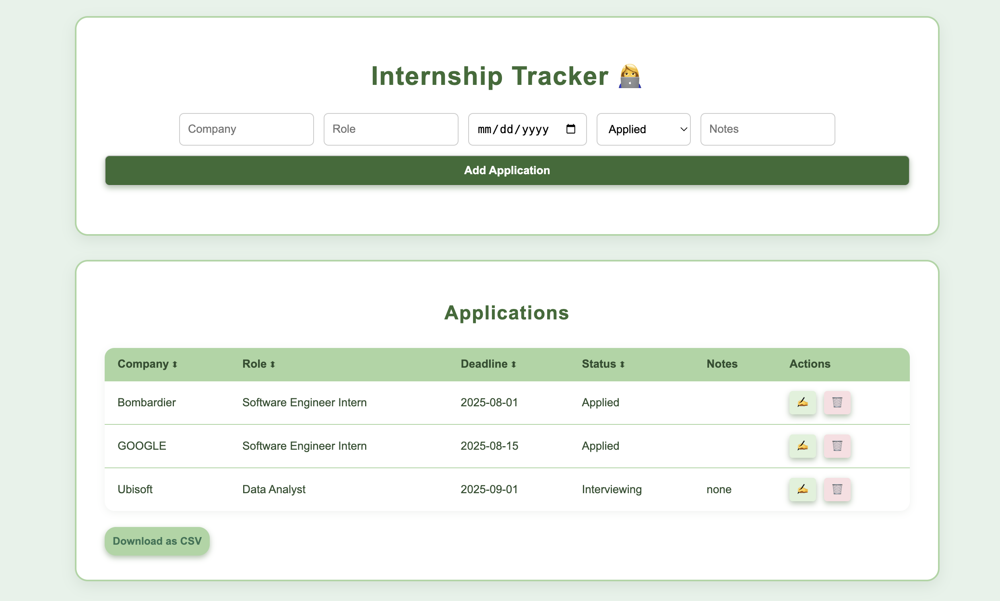

# 🗓️ Internship Application Tracker

A simple, browser-based internship/job application tracker built with **HTML**, **CSS**, and **JavaScript**. No backend
required — all data is stored in the browser using `localStorage`.

---

## 👩‍💻 Features

- ➕ Add internship or job applications
- 🗂 View applications in a sortable table
- 📝 Track company, role, date applied, status, and notes
- 🗑 Delete entries
- 💾 Automatically saves data locally in your browser

---

## 📸 Demo

 to be uploaded...<!-- Optional: Add a screenshot if you have one -->

---

## 🚀 Live Demo

[Click here to try it!](https://your-username.github.io/internship-tracker/)  to be uploaded...

---

## 📂 File Structure
internship-tracker/

├── index.html # Main HTML file

├── style.css # CSS styles

├── script.js # JavaScript logic

├── README.md

└── .gitignore

---

## 📌 Future Features

- UI polish/ Animations
- Light/dark mode switch

---

## 🙋‍♀ ️Author
Made with ❤️ by Mathilde Pellegrin

<!-- End of README.md -->

Because tracking applications on sticky notes wasn't scalable.